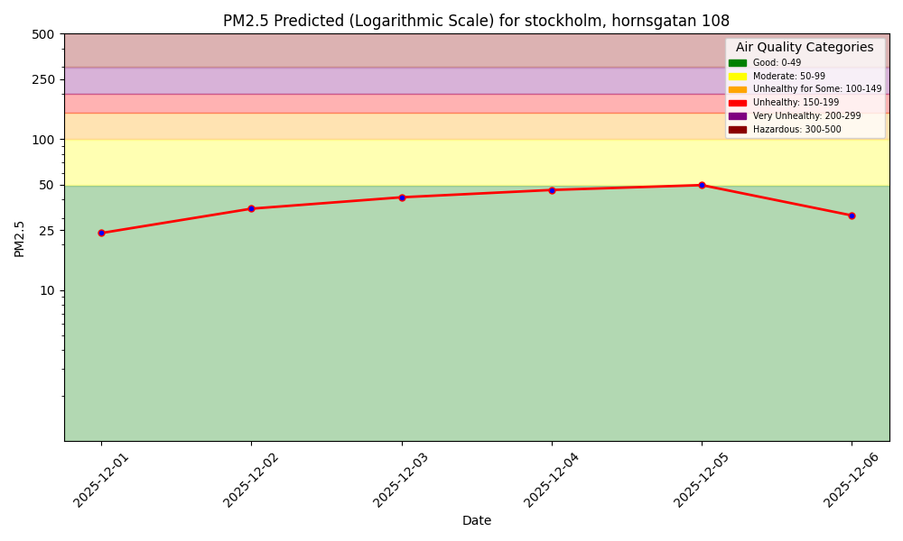
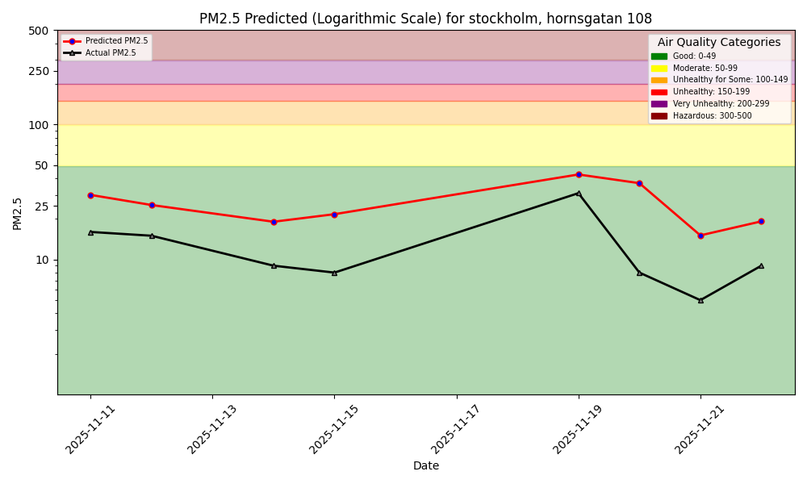

## Public URL
[Dashbord for AQ monitoring at Stockholm Hornsgatan 108](https://pontusluthi.github.io/mlfs-book/air-quality/)

# Instructions to run notebooks. 

## Install requirements
### Install 'uv' and 'invoke'
`pip install invoke dotenv`

### 'Install packages' 
`invoke install` to install python dependencies using uv and requirements.txt. 

### Numpy
You may need to downgrade to `numpy<2` e.g. `numpy==1.26.4`, if some imports fail. 

### API keys
You will need to define `HOPSWORKS_API_KEY` and `AQICN_API_KEY` as environment variables. 

## Running with PyInvoke
To run the scripts you can use the below invoke commands.

    invoke aq-backfill
    invoke aq-features
    invoke aq-train
    invoke aq-inference
    invoke aq-clean

# Project description
This project uses Hopsworks for feature groups and views as well as storing predictions models. 

## Data
Data is retrieved from [Open-Meteo](https://open-meteo.com/) and [AQICN](https://aqicn.org/) for weather data, predictions and historical, and historical air quality data, respectively. 

New predictions and hindcast graphs are generated once daily as defined per the air-quality-daily.yml instructions. The cron schedule defines when the workflow should run. 

## Examples
### Predictions graph

### Hindcast graph

There may be gaps in days in the hindcast graph if the script was not run the day before those. 
